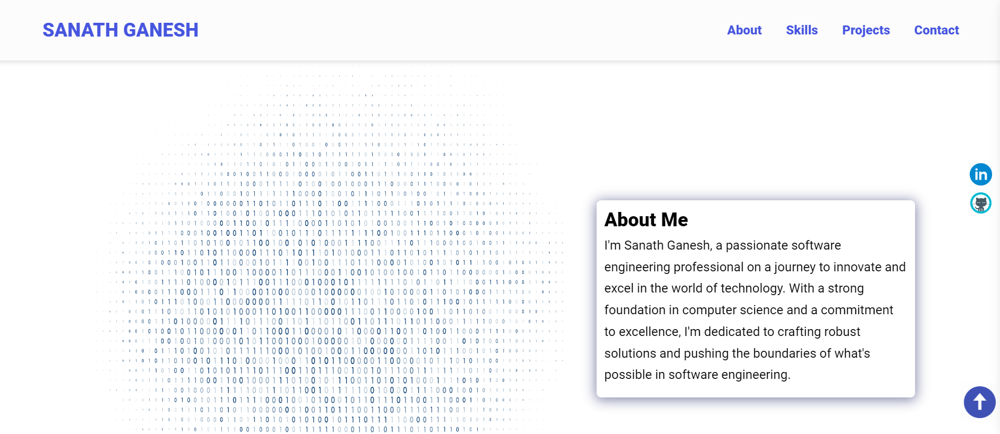

# SANATH PORTFOLIO

A portfolio website

## Author

[sanath-ganesh](https://github.com/sanath-ganesh)

## Sample Website

A live demo is available via this [link](https://sanath-ganesh.netlify.app/)

## Tech Stack

**Client:** HTML, CSS, Vanilla JavaSCript

## Tools Used

Below are are list of tools used, and the precise things they were used for:

- [Ion Icons](https://ionic.io/ionicons) for hambuger menu bar
- [Icon8](https://icons8.com/) for animated icons and skills icons
- [Animate CSS](https://animate.style/) for Sanath Ganesh's bio text animation
- [Formspree](https://formspree.io/) for contact form submision and straight delivery to Gmail

## Folder Structure

The index.html and readme files are in the root folder, alongside the screenshot included in the readme.

The assets folder contains the CSS and JavaScript files, all images and icons used, in their respective folders.
